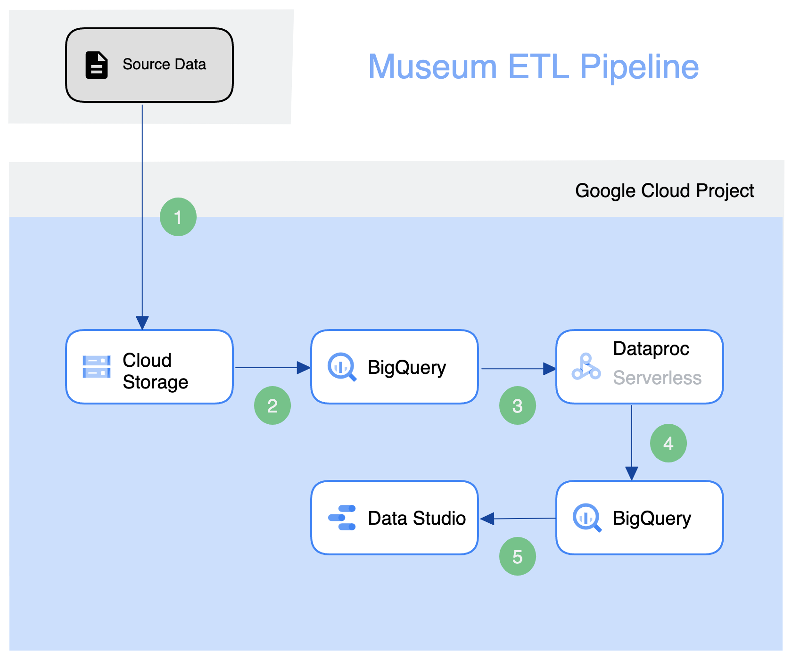

1. Requirements.txt
2. Readme update

## The project
The goal of the project is to get an idea of the general offering of the most popular museums.
The goal was to setup a generalized data pipeline, which would be able to process data from different museums and be able to show summarised details from them.

The project utilizes Google Cloud and its offered features, including:
- **Cloud Storage**: used to store raw museum data
- **BigQuery**: data warehouse solution, which enables processing the raw data and stores processed information about the museum items
- **Dataproc Serverless**: Google's Spark solution, which runs on demand, without the need to manage the Spark cluster itself. It is used to transform raw data into the desired form
- **Data Studio**: although not necessarily part of Google Cloud, but it is a Google product. It serves as the visualization solution for our data

## How to
1. Make sure Python is updated with requirements.txt
2. Prepare the infrastructure
   1. Download credentials for Google Cloud
   2. Run the setup.sh script
   3. Run Terraform / update the properties in the var file
3. Upload files manually / with the provided script to Google Cloud storage
4. Wait / Check in Google BigQuery that the items are picked up ???
5. Run the Spark script to transform the data (script must be created for unsupported museum types)
6. View the data (Is there a way to save the setup for Dat Studio?)