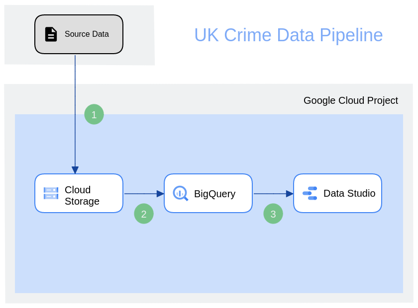
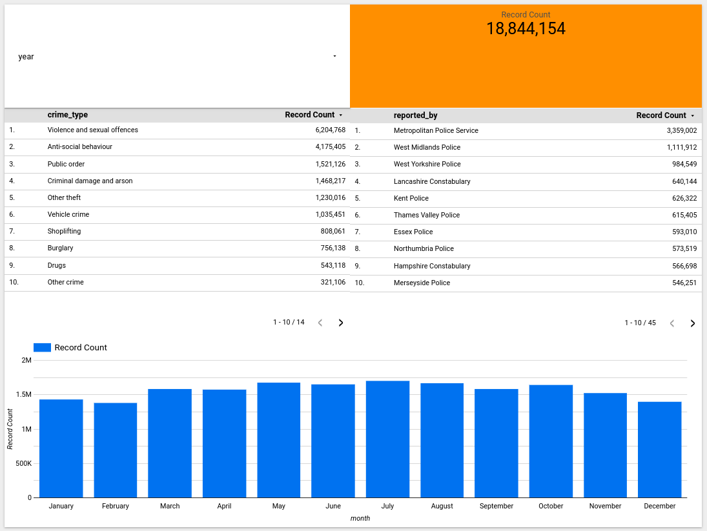

## Introduction

The [UK based crimes dataset](https://data.police.uk/) is a valuable resource for researchers, analysts, and
policymakers interested in understanding
crime patterns and trends in the UK. The dataset provides information about the following and some more:

- When the street-level crime was committed
- What is the type of the crime
- Which police force reported the crime
- In which police force's responsibility the crime falls within
- Approximate location of the crime

This data report aims to provide an analysis of the crimes reported in the dataset,
highlighting the frequency of different
types of crimes and the workload of each police force in responding to the crimes.

Understanding crime patterns and trends is essential for designing effective policies and interventions to prevent and
reduce crime. By analyzing the data in this report, policymakers can identify areas of the UK where specific types of
crimes are more prevalent and allocate resources accordingly. Furthermore, law enforcement agencies can use the data to
better understand their workload and prioritize resources to ensure the safety of the public.

Overall, this data report provides valuable insights into the UK's crime landscape, which can inform evidence-based
policy and decision-making.

In the future it is also possible to use the dataset to generate heatmap based on the location information,
which would help recognize patterns when it comes to committed crimes.

## Technical introduction

The project utilizes Google Cloud and its offered features to process the crime dataset.

#### Cloud Storage

A cloud-based object storage service that provides a reliable and scalable
solution for storing and retrieving data in the cloud. Its robust security features, including encryption of data at
rest and in transit, access controls, and
audit logging, make it an ideal choice for data engineering and storage needs, particularly when used in conjunction
with Google BigQuery, a cloud-based data warehousing and analytics service. Together, Google Cloud Storage and
BigQuery provide a powerful and scalable solution for storing, processing, and analyzing large volumes of data in the
cloud.

#### BigQuery

Google BigQuery is a cloud-based data warehousing and analytics service provided by Google Cloud
Platform. It enables users to store, manage, and analyze large volumes of data quickly and easily using a serverless
architecture. BigQuery's ability to scale horizontally and process data in parallel across multiple nodes makes it
well-suited for handling large, complex datasets. It offers a powerful SQL-like query language and a web-based console
for managing and querying data, as well as integration with other Google Cloud Platform services, such as Google Cloud
Storage and Google Data Studio.

#### Data Studio

Google Data Studio, now named Looker Studio, is a cloud-based data visualization and reporting tool provided by Google
Cloud Platform. It enables users to easily create custom, interactive reports and dashboards using data from a variety
of sources, including Google BigQuery. Data Studio provides a drag-and-drop
interface for creating visualizations, as well as a library of pre-built report templates and integrations with other
Google Cloud Platform services.

## The project

The setup focuses on providing an optimized solution for
the end reports, but also leaves space for future improvements. The end reports focus on the yearly police forces
utilization, the monthly distribution of crimes in the given year and the breakdown of different crime types.

1. The historical data is uploaded to Google Storage, which serves as an intermittent storage before loading it into
   BigQuery
2. There are two inner steps when it comes to BigQuery related processes
    1. The data with all data points is loaded into BigQuery
    2. SQL transformation is performed on the raw data to extract the required information in order to create the
       reports. These data points include:
        - year
        - month
        - crime type
        - reporter force
    3. Since the reports will visualize data for given years, the processed dataset in partitioned on the year data
       point as an integer range partition key.
    4. The end reports are visualized in Google Data Studio

The end result looks like the following and can be viewed [here](https://lookerstudio.google.com/reporting/f8c0dedf-a371-48cb-95de-d3b07b705e8e)

The pipeline is automated to an extent that it is easy to reproduce. However, there are improvements that could be made
in order to make the future data processing easier, like including Google Function to fetch new monthly data and upload.

## Steps to reproduce

1. Create project in your preferred way make sure billing is enabled
2. Install gcloud and
   authenticate with `gcloud auth application-default login --project ${PROJECT_ID}` as 
   described [here](https://registry.terraform.io/providers/hashicorp/google/latest/docs/guides/provider_reference#running-terraform-on-your-workstation),
   so you can run the Terraform commands
3. Update variables in the Makefile
4. Create the bucket for Terraform with `make create-tf-be`
4. Run Terraform with `make apply-init`
5. Upload the files
    1. Download crime data from the [official site](https://data.police.uk/data/) to a directory in the project root
       called crime_data
    2. Make sure Python is installed and all the Python requirements are installed by running `pip install -r
       ./requirements.txt`
    3. Upload by running `make upload-data`
6. Run Terraform again to load uploaded data with `make apply-load`
7. Run Terraform again to transform raw data for the reports with `make apply-transform`
8. Create the Report with Studio

